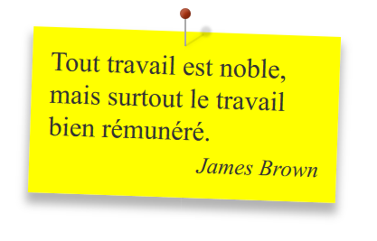

# html Elements
html part of codes

## color picker:
This small code will display a color picker (found on [w3c](https://www.w3schools.com/colors/colors_picker.asp) and simplified).


maybe you should modify the ```margin-bottom``` property of `selectedhexagon` to perfectly align selector.

## post-it:
This will create a [post-it](http://creative-punch.net/2014/02/create-css3-post-it-note/) like render.


