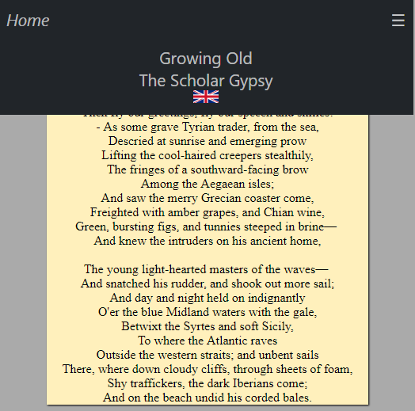
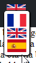
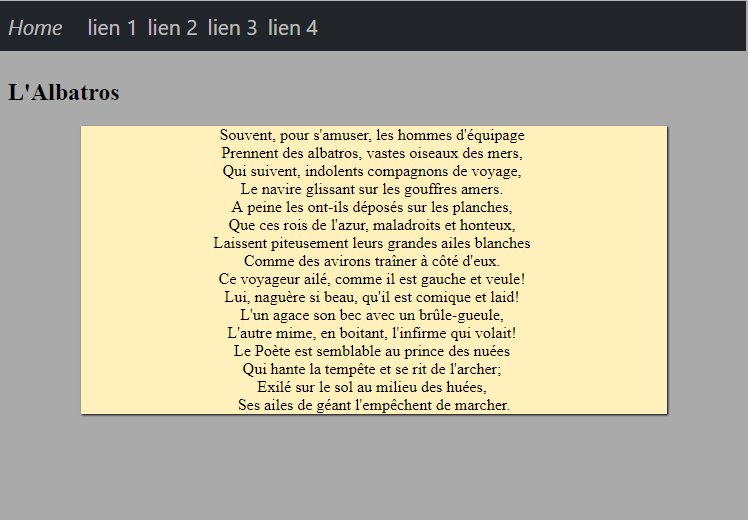
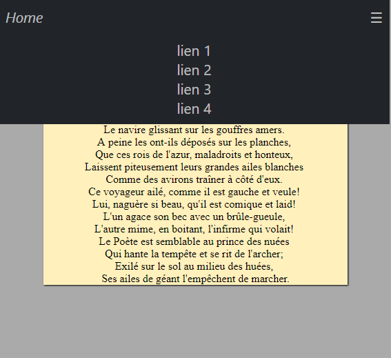
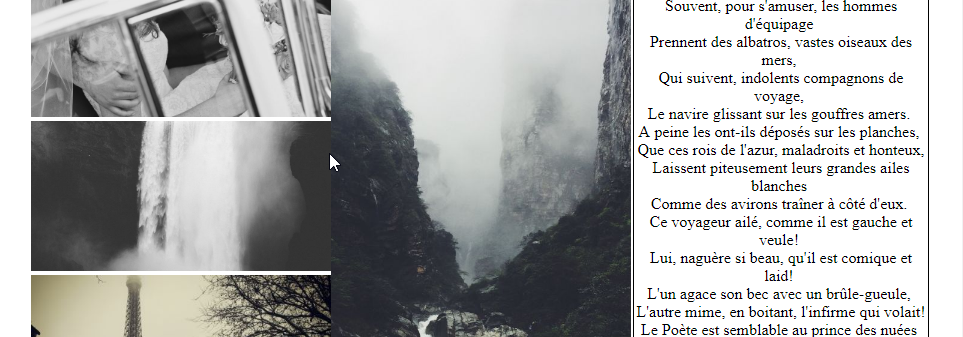
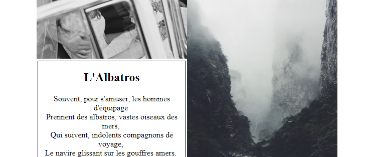
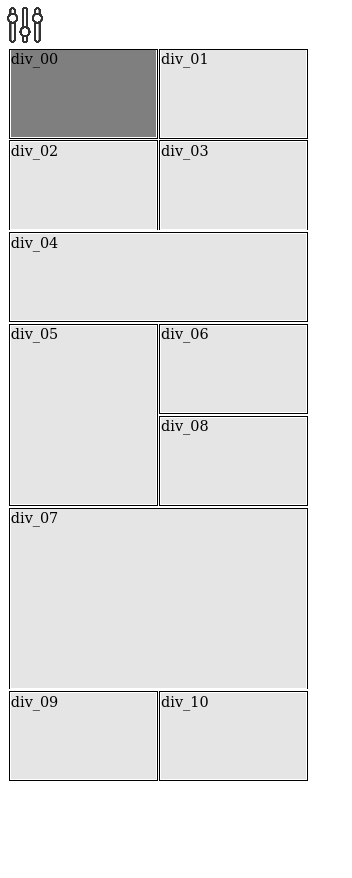
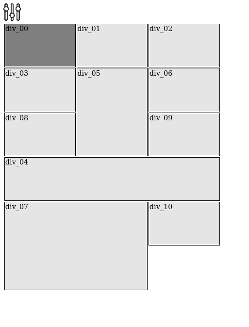
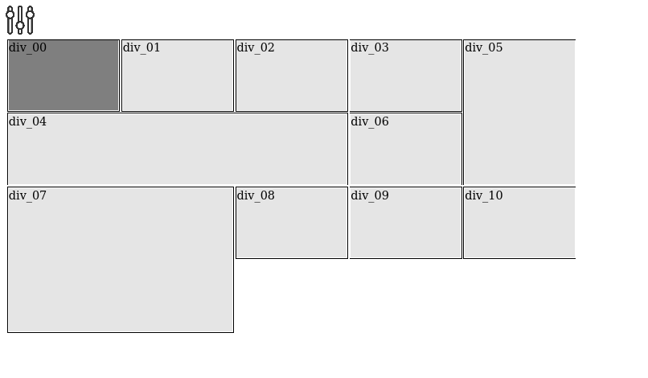

# html Elements
html part of codes

## full example:
An example is available for testing all, and small code for testing each elements.



## colour picker:
This small code will display a colour picker (found on [w3c](https://www.w3schools.com/colors/colors_picker.asp) and simplified).


ti create new color picker item you should add :

```HTML
<div id="newMap"></div>
<script type="text/javascript" src="path/to/colorPicker.js"></script>
<script type="text/javascript">
	createColorPiker ( "newMap", (color)=>{/*onclick*/}, (color)=>{/*mouseOverColor*/} );
</script>
```

You can define two callback one called on click and the second called when your mouse is moving over the picture.

## post-it:
This will create a [post-it](http://creative-punch.net/2014/02/create-css3-post-it-note/) like render.


## country/language selector:
This will display a flag/text selector to change the contry/language display easily, you can modify it simply by adding new flags/text or removing existent.

Remember a flag picker is not to choose a language according this rules [en](http://www.flagsarenotlanguages.com/blog/why-flags-do-not-represent-language/), [fr](https://zestedesavoir.com/tutoriels/3039/linternationalisation-et-ses-pieges-creer-un-logiciel-universel/gerer-differentes-langues/).



It was created with the least possible Javascript, and to use HTML5 and CSS3 tricks.

You can create a simple flag/ language picker like this :

```HTML
<div id="id" class="flagSelector" style="width: 32px;height: 21px;border-radius: 10px;"></div>
<section class="lang_en">
	English
</section>
<script src="js/countrySelector.js"></script>
```

```Javascript
 	languageSelector( "id", {
		language:[
			{
				lang:'en',
				text:'English'
			},
			...
		],
		langPart:"lang_"
	}, "en" );
```

Or you can create a flag/language picker with multi point access :

```HTML
<div id="id_1" class="flagSelector" style="width: 32px;height: 21px;border-radius: 10px;"></div>
<section class="contry_uk">
	United Kingdom
</section>
<div id="id_2" class="flagSelector" style="width: 32px;height: 21px;border-radius: 10px;"></div>
```

```Javascript
	let config_1 = {
		country:[
			{
				state:'uk',
				logo:'imgs/united-kingdom-flag.svg'
			},
			...
		],
		statePart:"contry_"
	};

	countrySelector ( "id_1", config_1, "uk" );
	countrySelector ( "id_2", config_1, "uk", "id_1" );
```

for some language you should change some CSS rules :
```javascript
let config = {
	language:[
		{
			lang:'ar',
			text:"العربية",
			style:"text-align:right"
		},
		...
	],
	langPart:"lang_"
};
```

## nav barre:
This will provide a small navigation barre responsive and customisable




This nav barre is not smart, so you can customize it simply in its configuration:

```Javascript
initMenuBarre ( "menu", [
	{
		el:'<a href="#AL" class="lang_fr">Au Lecteur</a>'
	},
	{
		el:'<a href="#A" class="lang_fr">L\'Albatros</a>'
	},
	{
		el:'<a href="#GO" class="lang_uk">Growing Old</a>'
	},
	{
		el:'<a href="#TSG" class="lang_uk">The Scholar Gypsy</a>'
	},
	{
		el:'<div style="margin-left:auto;float:right;display:flex;flex-direction:row;">\
			<span id="language" class="langSelector" style="padding-left:5px;padding-right:5px;"></span> \
			<div class="lightSlider" title="dark/light"></div>\
		</div>'
	}
]);
```

For this exemple I mixed navBarre, language slector and dark light switch.

## smoothScroller:
This part of code will provide a smooth scrollbar on link select, with a displacement in 0.3 second.

## carousel:
This part of code is to create a carousel


If you click once on the arrow, the display will be continue, you should click another time on the carousel to stop it.

To change only one image, you shoud click twice.

To modes exists for carousels, the first one only allow to change images one by one, the second one allow to create a infinite sliding carousel.

```HTML
<div id="carouselID" class="carousel"></div>
```

```Javascript
carouselJs( "carouselID", [
	"path/to/src"
], 100, {
	leftId:"carouselLeft",
	rightId:"carouselRight",
	leftContinus:true,
});
```

All can be configured on the constructor.
```Javascritp
option:{
	leftId:"string", // needed if you want to change default action
	rightId:"string", // needed if you want to change default action
	leftContinus:boolean, // default false
	rightContinus:boolean, // default false
	width:int, // default 100%, available values in px
	height:int // default 100%, available values in px
}
```

## grid:
This part of code provide a mecanism to feed a grid automaticly with content defined staticly without care about alignment.

### grid:
here a tool for object with not defined size




### grid 2:
here a tool for object with difned size.





## dark-light :
This part of code allow two them colors for the page.

The global CSS shouldn't include color rules, they should be add in two external CSS file and sourced in function of the selector.

```HTML
<head>
	<link id="lightCss" rel="stylesheet" href="/css/colorDark.css">
</head>
<div class="lightSlider_2"></div>
```

```Javascript
createSwitchs ( "lightSlider_2", ( flag ) => {
	if ( flag )
	{ // light mode
		document.getElementById ( 'lightCss' ).href = '/css/colorLight.css';
	}
	else
	{ // dark mode
		document.getElementById ( 'lightCss' ).href = '/css/colorDark.css';
	}
} );
```

You can add CSS in the main page as in exemple:

```HTML
<div class="lightSlider"></div>
<script type="text/javascript" src="js/dark-light.js"></script>
```

```Javascript
createDLSwitchStyle ( "lightSlider", '.lightCss{}', '.darkCSS{}');
```